# Robot Workspace

## What this is

The software for a self-driving indoor robot with a push handle. In short

- a laser scanner sees the surroundings
- the odometry packages turn what it sees into "where am I"
- the navigation package plans a path on a saved map and follows it
- the control package moves the wheels and blends in the push handle
- a webpage on a phone or laptop operates everything

## How the robot can be driven

| Mode | Authority | Who drives |
|---|---|---|
| Manual | — | The webpage joystick |
| Auto | Robot | Navigation drives alone |
| Auto | User | The push handle drives |
| Auto | Mix | Both together. The handle adds on top of navigation and fades out near obstacles |

## How the data flows

```mermaid
flowchart TD
    LIVOX[laser scanner<br>livox_driver] -->|points and motion data| FASTLIO[position estimate<br>fastlio]
    FASTLIO -->|3D pose| ADAPTER[flat odometry<br>fastlio_adapter]
    FASTLIO -->|3D points| CONVERTER[flat 2D scan<br>fastlio_converter]
    ADAPTER -->|where am I| NAV[navigation<br>plan and follow paths]
    CONVERTER -->|what is around| NAV
    CONVERTER -->|what is around| SYSTEM[central control<br>robot_system]

    WEB[webpage<br>web_interface] -->|mode, joystick, goals| SYSTEM
    WEB -->|goals and waypoints| NAV
    NAV -->|drive commands| SYSTEM
    HANDLE[push handle<br>teensy_driver] -->|force and angle| SYSTEM

    SYSTEM -->|wheel speeds| MOTORS[motor board<br>teensy_driver]
    SYSTEM -->|obstacle distance| SOUND[speaker<br>sound_driver]
    CAMERA[camera<br>oakd_driver] -->|seen objects| SOUND
```

Reading the chart top to bottom. The scanner feeds the position estimate. That
splits into two things navigation needs, where the robot is and what is around
it. The webpage sets the mode and sends goals. Navigation and the handle both
feed the central control, which decides the final wheel speeds and sends them
to the motor board. The speaker gets the obstacle distance for the proximity
beep and announcements from the camera.

## Packages

| Package | What it does |
|---|---|
| [`livox_driver`](src/livox_driver/README.md) | Driver for the laser scanner |
| [`fastlio`](src/fastlio/README.md) | Estimates the robot position from the scanner |
| [`fastlio_adapter`](src/fastlio_adapter/README.md) | Turns the scanner pose into flat robot odometry |
| [`fastlio_converter`](src/fastlio_converter/README.md) | Flattens the 3D points into a 2D scan |
| [`navigation`](src/navigation/README.md) | Plans paths, follows them, builds the map |
| [`robot_system`](src/robot_system/README.md) | Central control and handle blending |
| [`teensy_driver`](src/teensy_driver/README.md) | Talks to the motor board |
| [`oakd_driver`](src/oakd_driver/README.md) | Camera with object detection |
| [`intersection`](src/intersection/README.md) | Names the junction type, optional |
| [`sound_driver`](src/sound_driver/README.md) | Speaker, beeps and announcements |
| [`web_interface`](src/web_interface/README.md) | The webpages |
| [`custom_message`](src/custom_message/README.md) | Shared message definitions |

## Starting the robot

Run these launch files, usually in this order.

| Step | Launch | Package | Starts |
|---|---|---|---|
| 1 | `base_launch.py` | `robot_system` | Device drivers, sound, webpages |
| 2 | `algorithm_launch.py` | `robot_system` | Position estimate and central control |
| 3 | `navigation_launch.py` | `navigation` | Driving on the saved map |
| 3 (alt) | `mapping_launch.py` | `navigation` | Building a new map instead |

The control page is on port 8090 and the log page on port 8091.

## CPU core plan

The computer has six cores. Every node is pinned to one with a `taskset`
prefix in the launch files, so heavy nodes never disturb time-critical ones.
Nodes that feed each other share a core, so a command flows through without
hopping between busy cores.

| Core | Job | Nodes |
|---|---|---|
| 0 | Operating system and light work | sound_driver, web_interface, robot_state_publisher, map_server, lifecycle managers |
| 1 | Sensor input | livox_driver, oakd_driver |
| 2 | Position estimate, alone | fastlio |
| 3 | Localization chain | fastlio_adapter, fastlio_converter, amcl, intersection |
| 4 | Motion chain | controller_server, velocity_smoother, robot_system, teensy_driver |
| 5 | Path planning | planner_server, behavior_server, bt_navigator |
| 4 and 5 | Mapping sessions only | slam_toolbox |

Why it is arranged this way

- **fastlio gets core 2 for itself.** It is the heaviest time-critical node.
  When it shared a core it fell behind exactly during turns, where falling
  behind hurts the most.
- **Core 4 is the motion chain.** A wheel command flows controller, smoother,
  central control, motor board, all on one core, so nothing busy sits between
  a command and the wheels.
- **Core 5 takes the planning bursts.** Replanning is bursty work and on its
  own core it can never delay a wheel command.
- **Core 0 stays light.** The operating system and the network interrupts of
  the scanner live there, so only small nodes join them.
- **Mapping borrows cores 4 and 5.** While building a map the navigation nodes
  are not running, so the map builder may use both free cores.
